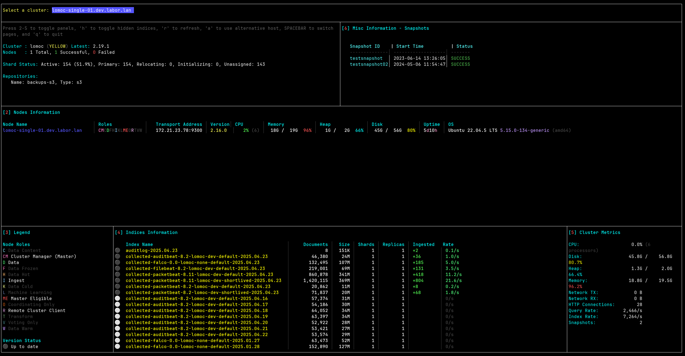

# Lomoctop - OpenSearch/LOMOC Terminal Dashboard

Extension of https://github.com/acidvegas/elastop.git

Lomoctop is a terminal-based dashboard for monitoring OpenSearch clusters in real-time. It provides a view of cluster health, node status, indices, and various performance metrics in an easy-to-read terminal interface.


## Installation

```bash
# Clone the repository
cd lomoctop
go build
```

## Usage

```bash
./lomoctop [flags]

# You may also add an alias to your .bashrc
echo "alias ltop='~/lomoctop/lomoctop -config ~/lomoctop/config.yml'" >> ~/.bashrc
```

### Command Line Flags
| Flag        | Description                           |
| ----------- | ------------------------------------- |
| `-config`     | Config File                  |


### Examples

```bash
./lomctop -config config.yml

# or when added the alias
ltop

```

## Configuration
The `config.yml` file allows you to define one or more OpenSearch clusters to monitor. Below is a description of each configuration field:

| Field            | Description |
|------------------|-------------|
| `protocol`       | The protocol used to connect to the OpenSearch cluster (typically `http` or `https`). |
| `hostname`       | The primary hostname of the OpenSearch cluster. |
| `url`            | A list of useful or related URLs for the cluster (e.g., dashboards, documentation, Grafana instances). These are not used for connection, just for reference. |
| `port`           | The port number on which the OpenSearch cluster is accessible (default is usually `9200`). |
| `user`           | The username used for basic authentication. |
| `password`       | The corresponding password for the user. |
| `api_key`        | Optional. An API key that can be used instead of user/password for authentication. |
| `ca_file_path`   | Optional. Path to the CA certificate file if using TLS and verifying server certificates. |
| `cert_file_path` | Optional. Path to the client certificate file for mutual TLS authentication. |
| `key_file_path`  | Optional. Path to the private key file for mutual TLS authentication. |
| `skip_tls_verify`| If set to `true`, TLS certificate verification will be skipped (not recommended for production). Useful for self-signed certs or dev environments. |

Each `host` entry represents a distinct OpenSearch cluster configuration. You can monitor multiple clusters by adding multiple entries in the `hosts` list.


```yaml
hosts:
  - protocol: https
    hostname: <opensearch-hostname>
    url:
      - <link-1>
      - <link-2>
    port: 9200
    user: <username>
    password: <password>
    api_key:
    ca_file_path: 
    cert_file_path:
    key_file_path:
    skip_tls_verify: true

  - protocol: https
    hostname: <opensearch-hostname>
    url:
      - <link-1>
      - <link-2>
    port: 9200
    user: <username>
    password: <password>
    api_key:
    ca_file_path: 
    cert_file_path:
    key_file_path:
    skip_tls_verify: true

```
